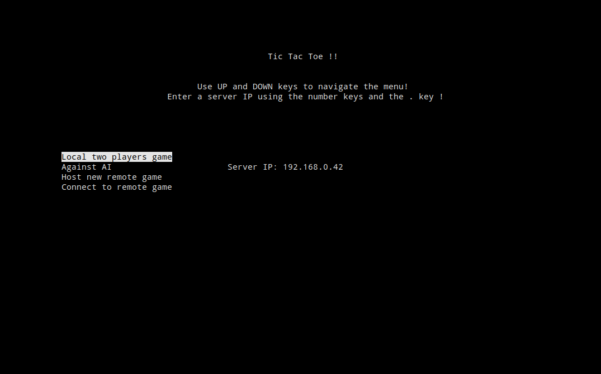
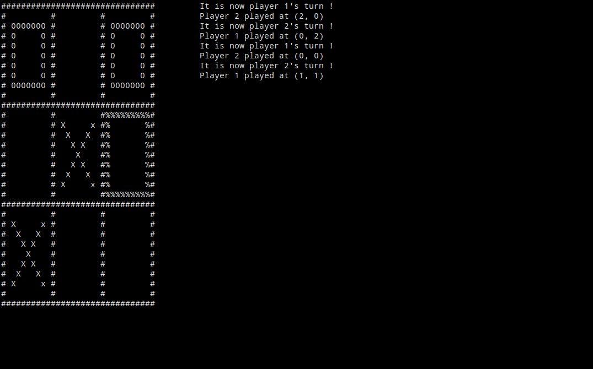

# Python Tic Tac Toe

A basic Tic-Tac-Toe game implemented in python.
It supports three game mode : "local vs", "local vs AI" and "network mode"

## Run

To run the game go to the src directory, and use 

```bash
python main.py
```

If you're on windows, you can alternatively get a binary from the release page of this repository.

## Screenshots





## Dependencies

This project only depends on the ncurses library.
All other depedencies should be already included in python.

